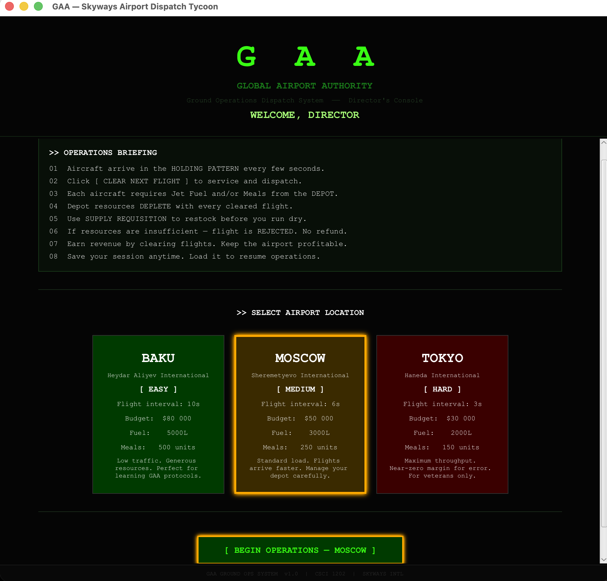
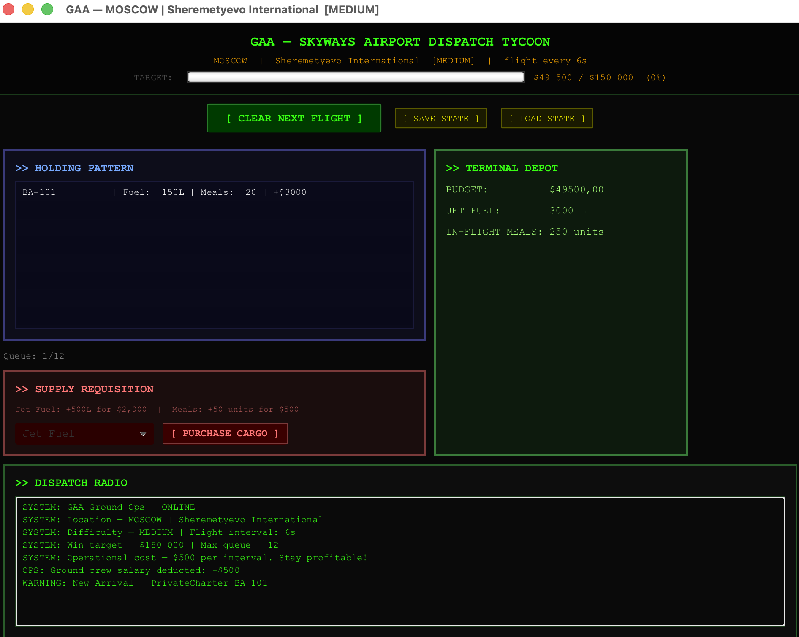
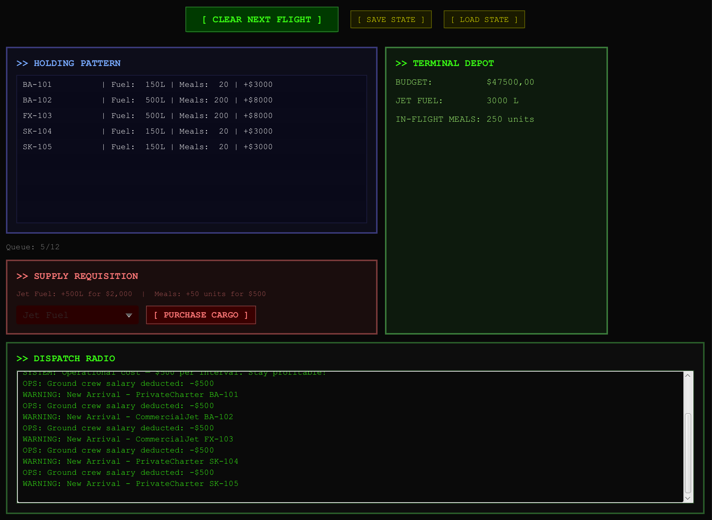
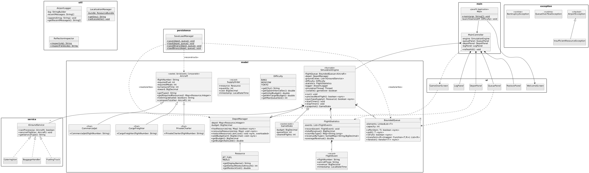

# Skyways Airport Dispatch Tycoon — Project Report

**Course:** CSCI 1202 Programming Principles II — Spring 2026
**Project:** Real-time Airport Ground Operations Simulation
**Stack:** Java 21 · JavaFX 21 · Maven

---

## 3.1 Team Information & Work Allocation

| # | Student | Role | Subsystem | Files Authored | Key Features Implemented | % |
|:-:|---|---|---|---|---|:-:|
| 1 | **Elvin Imanli** | Domain Modeler | `model/` (data classes) | `Aircraft.java`, `CommercialJet.java`, `CargoFreighter.java`, `PrivateCharter.java`, `Resource.java`, `Difficulty.java`, `FlightEvent.java`, `SupplyOrder.java` | Sealed `Aircraft` hierarchy with `permits` clause and final subclasses; abstract methods + `super` calls; `BigDecimal` rewards for precise money math; `Comparable<Aircraft>` for sorting; `Serializable` for binary save/load; `Resource` enum with switch-expression methods; `Difficulty` enum carrying full game configuration; immutable `FlightEvent` and `SupplyOrder` records with compact constructors and validation. | **25** |
| 2 | **Yusif Behbudov** | Engine & Game Logic | `model/` (engine/depot/queue/stats), `exception/` | `SimulationEngine.java`, `DepotManager.java`, `BoundedQueue.java`, `FlightStatistics.java`, `AirportException.java`, `InsufficientResourceException.java`, `QueueOverflowException.java`, `BankruptcyException.java` | Background simulation loop on a daemon `Thread` (`implements Runnable`) with `volatile` flag and `synchronized` state; `BigDecimal` budget arithmetic; method overloading on `DepotManager` (BigDecimal/double variants); nested static `GameState` snapshot; generic `BoundedQueue<T>` with bounded capacity and `<R> transform(Function<T,R>)` generic method; Stream API `FlightStatistics` (`groupingBy` + `TreeMap` + `reducing`); custom checked & runtime exception hierarchy. | **25** |
| 3 | **Abilmansur Amanbek** | UI & Application | `main/`, `ui/` | `Main.java`, `MainController.java`, `WelcomeScreen.java`, `QueuePanel.java`, `DepotPanel.java`, `LogPanel.java`, `RestockPanel.java`, `GameOverScreen.java` | Programmatic JavaFX UI; command-line argument parsing with switch expression + `yield`; engine-to-UI bridge via `Platform.runLater` and lambda callbacks; difficulty-card welcome screen with hover/click animations; victory/defeat overlay rendering Stream-based statistics; try-catch-finally on save/load buttons. | **25** |
| 4 | **Orkhan Bayramov** | Services & Infrastructure | `service/`, `persistence/`, `util/`, build | `IGroundService.java`, `FuelingTruck.java`, `CateringVan.java`, `BaggageHandler.java`, `SaveLoadManager.java`, `AirportLogger.java`, `LocalizationManager.java`, `ReflectionInspector.java`, `pom.xml`, `run.sh`, `run.bat`, `resources/messages*.properties` | Strategy-pattern `IGroundService` interface + 3 concrete crews (polymorphism); save/load with both NIO character streams (`Files.write` / `Files.readAllLines`) and binary serialization (`ObjectOutputStream` + `BufferedOutputStream`); `try-with-resources`; `StringBuilder`-based circular logger; `ResourceBundle` i18n with English + Azerbaijani locales; `Reflection` API inspector listing methods/fields/permitted subclasses; cross-platform launch scripts. | **25** |
| | | | | | **Total** | **100** |

> All four members participated equally in design, implementation, and code review across every package; primary authorship is listed above.

---

## 3.2 System Overview

**Skyways Airport Dispatch Tycoon** is a real-time simulation of ground operations at an international airport. The player acts as the airport director: aircraft (tasks) arrive periodically into a holding pattern (queue), and must be cleared by dispatching ground service crews (processors) that consume shared resources (jet fuel and in-flight meals) from a central depot.

**How tasks, resources, and processors interact:**

1. A background `Thread` (the `SimulationEngine`) wakes every N seconds (3–10s depending on difficulty), spawns a random `Aircraft`, and adds it to a `BoundedQueue<Aircraft>` of fixed capacity.
2. When the player clicks **CLEAR NEXT FLIGHT**, the engine polls the head of the queue and asks the `DepotManager` (whose methods are `synchronized`) whether all required resources are available.
3. If yes, every `IGroundService` in the crew list whose `canProcess(aircraft)` returns true executes its task; the depot is debited; revenue is added to the budget; and a `FlightEvent` record is appended to `FlightStatistics`.
4. The game ends with a **victory** when the budget reaches the win target, a **bankruptcy** loss when the budget falls below zero, or a **queue overflow** loss when too many aircraft accumulate. The end screen shows live statistics computed from recorded flight events using the Stream API.

### Gameplay Screenshots

| | | |
|:---:|:---:|:---:|
|  |  |  |

---

## 3.3 UML Class Diagram

**High-level relationships shown in the diagram:**
- `Aircraft` (sealed abstract) ◄── `CommercialJet`, `CargoFreighter`, `PrivateCharter` (final)
- `IGroundService` (interface) ◄── `FuelingTruck`, `CateringVan`, `BaggageHandler`
- `SimulationEngine` ◇──> `BoundedQueue<Aircraft>`, `DepotManager`, `List<IGroundService>`, `FlightStatistics`, `AirportLogger`
- `DepotManager` ◇──> `Map<Resource, Integer>`, `BigDecimal budget`
- `SimulationEngine.GameState` (nested static class) — immutable snapshot
- `FlightEvent`, `SupplyOrder` — `record` types
- `AirportException` ◄── `InsufficientResourceException` (checked); `RuntimeException` ◄── `QueueOverflowException`, `BankruptcyException`
- `MainController` ◇──> `SimulationEngine` and all UI panels

---

## 3.4 Key Design Decisions

### How tasks are structured
Aircraft are modeled as a **sealed abstract hierarchy** (`permits CommercialJet, CargoFreighter, PrivateCharter`). The base class is `Comparable<Aircraft>` (sorted by reward) and `Serializable` (for binary save). Each subclass declares its resource demand via `getRequiredResources()` returning an `EnumMap<Resource, Integer>` — the abstract method enforces that every concrete task type must declare what it consumes, and `EnumMap` is the optimal Map implementation for enum keys.

### How processors are selected (polymorphism)
The engine holds `List<IGroundService> groundCrews` populated with three concrete strategies (`FuelingTruck`, `CateringVan`, `BaggageHandler`). When a flight is dispatched, the engine iterates the list and invokes `crew.serviceFlight(aircraft)` only on services where `crew.canProcess(aircraft)` returns true. This is the classic strategy pattern — adding a new service type (e.g. `DeIcer`) requires zero changes to the engine.

### How resources are validated and consumed
`DepotManager.hasResources(required)` performs an atomic precondition check inside a `synchronized` block. Only if it returns true does `consumeResources(required)` deduct each entry. Because every depot mutator and accessor is `synchronized`, the simulation thread (which spawns aircraft and deducts operational costs) and the JavaFX Application Thread (which handles button clicks) cannot race. Budget arithmetic uses `BigDecimal` to avoid floating-point drift after many additions.

### How save/load is implemented
Two complementary I/O paths share the same `SaveLoadManager`:

- **CSV (character stream + NIO)** — human-readable. `Files.write(Path, lines, UTF_8)` writes a list of `BUDGET,...` / `RESOURCE,...` / `TASK,...` records; `Files.readAllLines()` plus a switch expression over the line tag rebuilds state.
- **Binary serialization (byte stream)** — exact restoration. `ObjectOutputStream` over a `BufferedOutputStream` writes the `BigDecimal` budget, the `Map<Resource, Integer>` depot, and a serialized `ArrayList<Aircraft>`. The sealed hierarchy is `Serializable` end-to-end. `try-with-resources` guarantees stream cleanup.

### Threading model
The simulation runs on a **daemon `Thread`** (`SimulationEngine implements Runnable`); the UI runs on the JavaFX Application Thread. All shared state is guarded by `synchronized` (on the engine, on `DepotManager`, on `BoundedQueue<T>`). Engine→UI notifications go through `Platform.runLater` so that JavaFX panels are only mutated on the FX thread. The `gameOver` flag is `volatile` so the simulation thread sees writes from the FX thread immediately without entering the lock.

### Course concept coverage
| Week | Topic | Concrete usage in the project |
|:---:|---|---|
| 2 | `var`, switch expressions, command-line args | `Main.java` parses `--difficulty=` via `switch(...) { ... yield null; }` |
| 6 | Sealed classes, records, BigDecimal, nested classes | `Aircraft sealed`, `FlightEvent`/`SupplyOrder` records, `SimulationEngine.GameState` |
| 7 | Exception handling | Custom `AirportException` hierarchy + try-catch-finally in `MainController` save/load |
| 10 | Generics with bounded types | `BoundedQueue<T> implements Iterable<T>`, generic method `<R> transform(Function<T,R>)` |
| 11 | Lambdas, Stream API | `FlightStatistics.revenueByType()` uses `groupingBy` + `TreeMap` supplier + `reducing` |
| 12 | I/O, NIO, serialization | `Files.write`, `Files.readAllLines`, `ObjectOutputStream`, try-with-resources |
| 13 | Threads & synchronization | `Thread`, `Runnable`, `volatile boolean gameOver`, `synchronized` methods |
| 14 | i18n, reflection, assertions | `ResourceBundle("messages")` with `messages_az.properties`; `ReflectionInspector` lists methods/fields/permitted subclasses |
